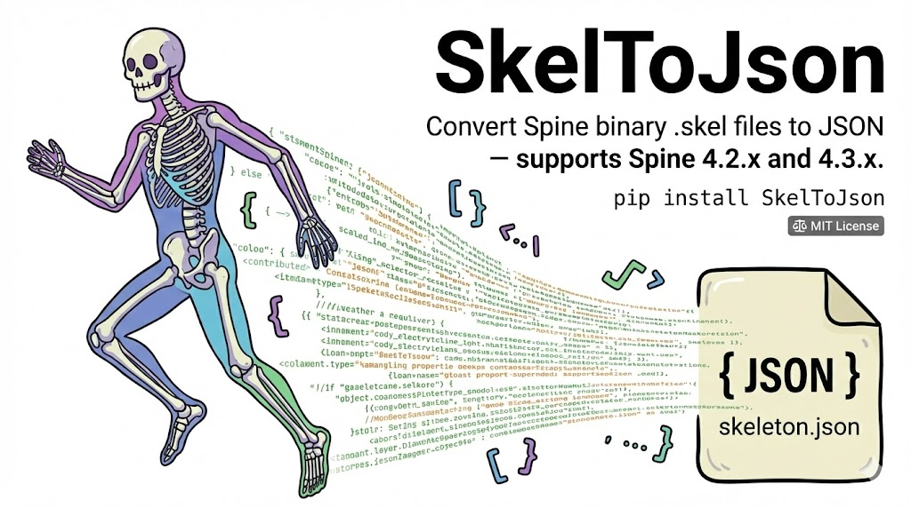

# SkelToJson - Spine 2D Binary to JSON Converter



Convert Spine 2D binary `.skel` files to human-readable JSON — supports **Spine 4.2.x** and **4.3.x**.

## What is Spine 2D?

[Spine](https://esotericsoftware.com/) is a 2D animation tool widely used in games, apps, and web content. It lets artists rig a skeleton of **bones** onto 2D images, then animate them with keyframes — producing smooth, lightweight character animations without frame-by-frame sprite sheets.

## `.skel` vs `.json` — What's Inside?

Spine exports skeleton data in two formats:

### `.skel` — Binary format (compact, not readable)

The `.skel` file is a **binary** encoding of the entire skeleton. It's optimized for size and loading speed, but completely unreadable — it's just raw bytes:

```
c2b3a848 2ee43256 07342e32 2e343300
c3160000 c3de0000 43960000 44610000
42c80000 00011f61 6e746963 69706174
696f6e ...
```

### `.json` — JSON format (human-readable, editable)

The JSON export contains the same data in a structured, readable format. Here's the structure:

| Section | Description |
|---------|-------------|
| `skeleton` | Metadata: Spine version, hash, dimensions, reference scale |
| `bones` | Bone hierarchy — each bone has a name, parent, position, rotation, scale |
| `slots` | Slots attached to bones — define draw order and which attachment is visible |
| `skins` | Groups of attachments (images, meshes, bounding boxes) mapped to slots |
| `ik` | IK (Inverse Kinematics) constraints — bones follow a target |
| `transform` | Transform constraints — bones copy another bone's transform |
| `path` | Path constraints — bones follow a path curve |
| `physics` | Physics constraints — bones react to movement with inertia, gravity, wind |
| `events` | Named events triggered at specific times in animations |
| `animations` | All animations with keyframed timelines for bones, slots, attachments, constraints |

## Conversion Example

**Input:** `anticipation.skel` — 224 bytes of binary data

**Output:** `anticipation.json` — structured, readable:

```json
{
  "skeleton": {
    "hash": "2ee43256c2b3a848",
    "spine": "4.2.43",
    "x": -150,
    "y": -444,
    "width": 300,
    "height": 900,
    "referenceScale": 100
  },
  "bones": [
    { "name": "root" }
  ],
  "slots": [
    {
      "name": "anticipation",
      "bone": "root",
      "attachment": "anticipationv2/anticipationv2_"
    }
  ],
  "skins": [
    {
      "name": "default",
      "attachments": {
        "anticipation": {
          "anticipationv2/anticipationv2_": {
            "y": 6,
            "width": 300,
            "height": 900,
            "sequence": { "count": 31, "start": 0, "digits": 2, "setup": 0 }
          }
        }
      }
    }
  ],
  "animations": {
    "animation": {
      "attachments": {
        "default": {
          "anticipation": {
            "anticipationv2/anticipationv2_": {
              "sequence": [
                { "mode": "loop", "index": 0, "delay": 0.03333 },
                { "time": 1, "mode": "loop", "index": 0, "delay": 0.03333 }
              ]
            }
          }
        }
      }
    }
  }
}
```

This is a simple skeleton with 1 bone, 1 slot, and a sequence-based attachment animation. Real game skeletons will have hundreds of bones, complex mesh deformations, IK chains, physics simulations, and dozens of animations.

## Installation

```bash
pip install SkelToJson
```

## CLI Usage

```bash
# Convert a single file
skel-to-json skeleton.skel

# Convert with custom output path
skel-to-json skeleton.skel -o output.json

# Convert all .skel files in a directory
skel-to-json skeletons/

# Convert directory with custom output directory
skel-to-json skeletons/ -o output/
```

## Python API

```python
from SkelToJson import convert_skel_to_json, convert_directory, SkelConverter

# Convert a single file
convert_skel_to_json("skeleton.skel", "skeleton.json")

# Convert all .skel files in a directory
convert_directory("skeletons/", "output/")

# Low-level: convert raw bytes to dict
converter = SkelConverter()
result = converter.convert(skel_bytes)
```

## Supported Formats

| Version | Status |
|---------|--------|
| Spine 4.2.x | ✅ Fully supported |
| Spine 4.3.x | ✅ Fully supported |

## License

MIT
